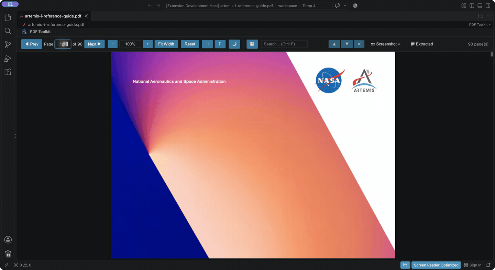

# PDF Toolkit for VS Code

View PDFs, extract the pages and figures you need, and bring them into your AI coding workflow.

Export selected pages as PNG/JPEG images, extract embedded raster figures at their native pixel dimensions, and choose which saved images to attach to GitHub Copilot Chat.

**Author:** Tim Haintz  
**License:** MIT

## From a PDF page to Copilot Chat

**Open PDF → choose a page → export an image → discuss it**



*Export a page, select a saved image, and prepare a Copilot question with it attached. The example question is not sent.*

1. Open a PDF in a VS Code workspace and go to the page you need.
2. Choose **📷 Screenshot → Current Page**. For specific page ranges, resolution and PNG/JPEG format, choose **Custom...** instead.
3. Click **📁 Extracted**, choose the saved folder, then **Add Selected Pages to Copilot Chat**. Check the image files you want and press **Enter**.
4. In Copilot Chat, choose a model that supports image input, review the attachments and ask a question such as “Explain this diagram.”

Choose the export that fits your content:

| Content you want | Menu option | Result |
| --- | --- | --- |
| A whole page, including its text, layout and vector diagrams | **Screenshot → Current Page** or **Custom...** | A rendered page image at your chosen quality. |
| A photo or raster figure stored inside the PDF | **Screenshot → Extract Images** | Individual embedded raster images at their native dimensions; scans the document. |

Page screenshots capture the whole page. They do not crop a selected figure or region. Vector charts are captured through page screenshots; **Extract Images** finds embedded raster images.

Rendering and export happen inside VS Code. Attaching an image hands it to Copilot; see [Privacy and data handling](#privacy-and-data-handling).

## Table of Contents

- [Why PDF Toolkit?](#why-pdf-toolkit)
- [Features](#features)
- [Installation](#installation)
- [Usage](#usage)
  - [Opening PDFs](#opening-pdfs)
  - [Toolbar Controls](#toolbar-controls)
  - [Keyboard Shortcuts](#keyboard-shortcuts)
  - [Commands](#commands)
  - [Custom Screenshot Wizard](#custom-screenshot-wizard)
  - [Page Extraction](#page-extraction)
  - [Composite Screenshots](#composite-screenshots)
  - [Attach Selected Images to Copilot Chat](#attach-selected-images-to-copilot-chat)
- [Configuration](#configuration)
  - [Debug Logging](#debug-logging)
  - [Changing the Screenshots Folder](#changing-the-screenshots-folder)
- [Technical Details](#technical-details)
- [Requirements](#requirements)
- [Privacy and Data Handling](#privacy-and-data-handling)
- [Responsible Use](#responsible-use)
- [Contributing](#contributing)
- [Development and Testing](DEVELOPMENT.md)
- [Issues & Feature Requests](#issues--feature-requests)
- [License](#license)
- [Author](#author)

## Why PDF Toolkit?

PDF Toolkit helps you inspect a document and prepare the content you want to discuss: a page from a technical specification, a research figure, or a small group of pages.

- **Choose the relevant content:** export the current page or specific page ranges, then select individual saved images for chat.
- **Control the output:** choose image quality and PNG/JPEG format, or combine pages into grid or vertical composite PNGs.
- **Keep the workflow in VS Code:** view and navigate the PDF, inspect saved images, and attach the files you choose to Copilot Chat.

[GitHub Copilot also supports PDF attachments when using a model with image input](https://docs.github.com/en/copilot/how-tos/copilot-in-your-ide/chat-with-copilot/chat-in-ide?tool=vscode#using-images-in-copilot-chat). PDF Toolkit adds control over page selection, image preparation and the files you attach. Viewing and export work without Copilot; image analysis depends on the assistant and model you use.

## Features

### PDF Viewing
- **Native PDF Rendering**: View PDF files directly in VS Code using Mozilla PDF.js
- **Text and Graphics**: Render PDF text, images and vector graphics using PDF.js
- **Scroll-based Viewing**: Scroll through all pages continuously
- **Text Selection**: Select and copy text directly from PDFs
- **Dark Mode**: Toggle inverted colours for comfortable reading (🌙 button or `D` key)

### Navigation and Zoom
- **Zoom Controls**: Zoom in, zoom out, fit to width, and reset zoom
- **Page Navigation**: Jump to any page using toolbar or keyboard
- **Page Rotation**: Rotate pages 90° clockwise (`R`) or counter-clockwise (`Shift+R`)
- **Keyboard Shortcuts**: Full keyboard support for efficient navigation

### Search and Outline
- **Search (Ctrl+F)**: Find text within PDF documents with real-time highlighting
- **Match Navigation**: Navigate between search matches with prev/next buttons or Enter key
- **Match Counter**: See current match position and total count (e.g., "3 of 17")
- **Outline/TOC Panel**: Toggle document outline sidebar to navigate via bookmarks (`O` key)

### Export Pages as Images (Screenshots)
- **Screenshot Menu**: Click the 📷 Screenshot button for quick access to all export options
- **Current Page**: Save the currently viewed page as a PNG/JPEG image
- **Custom Wizard**: Select specific pages, resolution (72-288 DPI), and format (PNG/JPEG)
- **All Pages**: Export every page of a PDF as individual images
- **Composite PNGs**: Combine up to 16 pages per image in a vertical stack, or up to 4 in a 2×2 grid, with optional spacing and page labels. Group longer selections into multiple images automatically; image size limits can split groups further.
- **Selected Copilot Attachments**: Choose individual saved PNG/JPEG files with checkboxes before attaching them to GitHub Copilot Chat, including page screenshots, embedded images, and composites.

### Extract Embedded Raster Images
- **Extract Embedded Images**: Extract embedded raster images (photos, bitmaps, pre-rendered figures) from PDFs at their native pixel dimensions
- **Automatic Detection**: Scans all pages for embedded image objects (JPEG, PNG, inline images) using PDF.js operator analysis
- **Smart Naming**: Filenames include image index, page number, and dimensions (e.g., `image_001_page3_800x600.png`)
- **Copilot Integration**: Add extracted images directly to GitHub Copilot Chat for AI analysis
- **Duplicate Detection**: Skips embedded-image files that have already been extracted

> **Note:** "Extract Images" finds embedded **raster** images (photos, bitmaps) stored inside the PDF. Charts and diagrams drawn as **vector graphics** (common from matplotlib, R/ggplot, Excel, LaTeX/TikZ) are not embedded images — use **Screenshot** to capture those pages instead.

## Installation

### From VS Code Marketplace (Recommended)
1. Open VS Code
2. Go to Extensions (`Ctrl+Shift+X`)
3. Search for "PDF Toolkit"
4. Click **Install**

Or install directly via the command line:

**Bash / macOS / Linux:**
```bash
code --install-extension TimHaintz.pdf-toolkit
```

**PowerShell:**
```powershell
code --install-extension TimHaintz.pdf-toolkit
```

**Command Prompt (cmd):**
```cmd
code --install-extension TimHaintz.pdf-toolkit
```

### From VSIX File
1. Download the `.vsix` file
2. Open VS Code
3. Press `Ctrl+Shift+P` and type "Install from VSIX"
4. Select the downloaded `.vsix` file

## Usage

### Opening PDFs
Simply open any `.pdf` file in VS Code. The PDF Toolkit will automatically display it.

### Toolbar Controls

The toolbar uses smaller controls in narrow editors and stays on one row. As
space runs out, rotation, Reset, dark mode and outline, then Search move into
**More**. Page navigation, zoom, Screenshot, and Extracted stay in the toolbar.
If even those controls cannot fit, scroll the toolbar horizontally; tabbing to
an inline control also brings it into view. This works when you split the editor
or open the Copilot sidebar.

Open **More** to use the controls moved there. Use Tab and Shift+Tab to move
between its buttons and inputs; Escape closes it and returns focus to More.
Ctrl+F (Cmd+F on macOS) exposes and focuses Search wherever it is located. Resizing
preserves your search text, input focus, and the controls' current state; More
opens if a focused control moves there.

The **Screenshot** menu stays within the PDF editor's visible area. Use Up/Down
Arrow to move through its actions, Home/End to jump to the first/last action,
Escape to close it and return to the Screenshot button, or Tab to leave the menu.

| Button | Action |
|--------|--------|
| Prev / Next | Navigate between pages |
| Page Input | Jump to a specific page |
| - / + | Zoom out / in |
| Fit Width | Zoom to fit the page width |
| Reset | Reset zoom to 100% |
| 📷 Screenshot ▾ | Opens screenshot menu with options: |
| └ 📄 Current Page | Extract current page as image |
| └ 📚 All Pages | Extract all pages as images |
| └ ⚙️ Custom... | Open multi-step wizard for custom extraction |
| └ ▦ Composite... | Combine selected pages into PNG images |
| └ 🖼️ Extract Images | Extract embedded raster images (photos, bitmaps) |
| ↶ / ↷ | Rotate pages counter-clockwise / clockwise |
| 🌙 | Toggle dark mode |
| 🔍 Search | Search text within the PDF (Ctrl+F) |
| 📑 Outline | Toggle document outline/TOC sidebar |
| 📁 Extracted | Browse previously extracted PDFs |
| More | Show controls moved out of the toolbar when space is limited |

### Keyboard Shortcuts

| Key | Action |
|-----|--------|
| Left Arrow or Page Up | Previous page |
| Right Arrow or Page Down | Next page |
| Home | First page |
| End | Last page |
| + or = | Zoom in |
| - | Zoom out |
| R | Rotate pages clockwise (90°) |
| Shift + R | Rotate pages counter-clockwise (90°) |
| D | Toggle dark mode |
| Ctrl + F | Focus search input |
| O | Toggle outline/TOC panel |
| Escape | Clear search / Close outline |

### Commands

Access via Command Palette (`Ctrl+Shift+P`):

- `PDF Toolkit: Open PDF` - Open a PDF file using file picker
- `PDF Toolkit: Screenshot Menu` - Open screenshot options menu
- `PDF Toolkit: Screenshot All Pages` - Export all pages as images
- `PDF Toolkit: Screenshot Current Page` - Export currently viewed page
- `PDF Toolkit: Screenshot Custom...` - Open multi-step wizard for custom extraction
- `PDF Toolkit: Screenshot Composite...` - Combine selected pages into PNG images
- `PDF Toolkit: Browse Extracted PDFs` - View and manage previously extracted PDFs
- `PDF Toolkit: Attach Extracted Pages to Copilot Chat` - Choose an extracted folder and optionally filter its images by page range
- `PDF Toolkit: Zoom In` - Increase zoom level
- `PDF Toolkit: Zoom Out` - Decrease zoom level
- `PDF Toolkit: Reset Zoom` - Reset to 100% zoom

### Custom Screenshot Wizard

The **Custom** option in the screenshot menu opens a 3-step wizard:

1. **Select Pages**: Enter page numbers or ranges (e.g., `1,3,5-10`) or type `all`
2. **Select Resolution**: Choose from:
   - Standard (72 DPI) - Smaller files
   - High (144 DPI) - Balanced quality
   - Very High (216 DPI) - Better quality
   - Maximum (288 DPI) - Best quality
3. **Select Format**: Choose PNG (lossless) or JPEG (smaller size)

### Page Extraction

When you extract pages, they are saved to a `PDF-Screenshots/<pdf-name>/` folder in your workspace. Extracted embedded images are also saved to the same folder with descriptive filenames. The extension tracks your extractions so you can easily:

- Browse previously extracted PDFs via the **📁 Extracted** button
- Attach all saved images or choose individual files for Copilot Chat
- Manage your extraction history

### Composite Screenshots

Choose **📷 Screenshot → Composite...**, or run **PDF Toolkit: Screenshot Composite...**.
Select pages/ranges (such as `1-16`), a layout, maximum pages per image, resolution,
and appearance. The number of pages selected is separate from the maximum number
combined into each output image:

| Layout | Maximum pages per image | Example with 10 selected pages |
| --- | --- | --- |
| 2×2 Grid | Choose 1–4 | With 4 pages/image, normally three PNGs contain 4 + 4 + 2 pages. |
| Vertical Stack | Choose 1–16 | With 10 pages/image, one tall PNG contains all 10 if it fits the image size limits. |

Grid uses up to two columns; it does not automatically expand into a larger grid
for longer selections. The final image can contain fewer pages than the chosen
maximum. For example, a 16-page selection grouped four at a time produces four
PNGs, subject to the size limits below.

Composites use a white background and are saved separately in
`PDF-Screenshots/<pdf-name>-composites/`, so browsing and attaching them does not
mix them with individual page screenshots. Filenames identify the included pages,
layout, resolution, and appearance. Existing files require an overwrite decision.
Each image keeps the selected resolution; groups split further if they would exceed
8,192 pixels on either side or 32 million pixels. If a single page is too large,
choose a lower resolution. Large stitched images may become harder to read when
an assistant resizes them; use smaller groups or higher resolution as appropriate.

Use **Add to Copilot Chat** after export, or select the composite folder in
**📁 Extracted** and choose **Add Selected Pages to Copilot Chat** to pick individual
composite files. The **Attach Extracted Pages to Copilot Chat** command also supports
page filtering: it attaches an entire composite if it contains any selected page.
Creating a PNG saves it to your configured screenshots folder; attaching it to
chat is a separate action.

### Attach Selected Images to Copilot Chat

1. Click **📁 Extracted**, or run **PDF Toolkit: Browse Extracted PDFs** from the Command Palette.
2. Select the folder containing your saved page screenshots, embedded images, or composites.
3. Choose **Add Selected Pages to Copilot Chat**.
4. Check the image files you want to attach, then press **Enter**. The list shows each filename, its page information, and PNG/JPEG format. No files are checked initially.

Only the checked files are attached. Press **Escape** to cancel, or confirm with
nothing checked to finish without attaching anything. Selecting more than 20
files displays a warning and reopens the list with your checks preserved, so you
can reduce the selection. **Add All Images to Copilot Chat** attaches every image
in the folder and offers **Select Images** when there are more than 20 files.
The limit applies to the files selected for this attachment action.

A composite is one image file and counts as one attachment, even when it contains
several PDF pages. Selecting that file attaches the whole image; it does not
extract individual pages from the composite. Choose individual page screenshots
when you need to share only one page from an existing composite.

## Configuration

| Setting | Default | Description |
|---------|---------|-------------|
| `pdfToolkit.defaultZoom` | `1.0` | Default zoom level |
| `pdfToolkit.showToolbar` | `true` | Show the PDF toolbar |
| `pdfToolkit.extractionQuality` | `2.0` | Quality scale (1.0=72dpi, 2.0=144dpi, 3.0=216dpi) |
| `pdfToolkit.extractionFormat` | `png` | Image format (`png` or `jpeg`) |
| `pdfToolkit.screenshotsFolder` | `PDF-Screenshots` | Folder name for storing extracted screenshots |
| `pdfToolkit.debug` | `false` | Enable debug logging to the Output panel (PDF Toolkit Debug channel) |

### Debug Logging

To enable debug logging:
1. Open **Settings** (`Ctrl+,`) and search for `pdfToolkit.debug`
2. Check the box to enable it
3. Reopen any PDF file (the setting is applied when a PDF is opened)
4. Open **View → Output** and select **PDF Toolkit Debug** from the dropdown

Debug output includes search match details, text layer diagnostics, and other internal state useful for troubleshooting. Set `pdfToolkit.debug` to `false` (unchecked) to disable — there is zero overhead when disabled.

### Changing the Screenshots Folder

You can change the folder name where screenshots are saved:
1. Click **📁 Extracted** button in the PDF viewer
2. Select **⚙️ Change Folder Name...**
3. Enter your preferred folder name
4. Click **🔄 Refresh** to scan the new folder

Or change it directly in VS Code Settings: search for "PDF Toolkit Screenshots Folder".

## Technical Details

This extension uses:
- **PDF.js**: Mozilla PDF rendering library
- **VS Code Custom Editor API**: For seamless editor integration
- **Webview**: For rendering PDF content

## Requirements

- VS Code 1.96.0 or higher

## Privacy and Data Handling

PDF Toolkit renders PDFs inside VS Code using bundled PDF.js and saves exported images to your configured screenshots folder. The default is `PDF-Screenshots/` under the first workspace folder, or beside the PDF when no workspace is open. PDF Toolkit does not implement telemetry collection or a document-upload service. Storage and access depend on your VS Code environment; remote or synchronized folders may transfer content through their associated services.

**Add to Copilot Chat** and the selected-image action open Chat with image files attached; they do not submit a question automatically. Once you attach or send content, its handling is governed by VS Code, GitHub Copilot and your chosen AI service. Review the files you attach and your organisation's sharing policies.

PDF Toolkit stores extraction history in VS Code workspace state. Optional debug logging is off by default; when enabled, it writes diagnostics to the VS Code Output panel and can include document text. Review logs before sharing them.

## Responsible Use

PDF Toolkit is a tool for viewing and extracting images from PDF files. Users are responsible for ensuring their use complies with applicable laws and policies.

### ✅ Generally Appropriate Use
- Your own documents and creations
- Public domain materials
- Documents you have explicit permission to copy
- Fair use purposes (research, education, commentary, criticism)
- Work documents you're authorized to access and share

### ⚠️ Consider Before Extracting
- **Copyrighted materials** - Respect intellectual property rights
- **Confidential documents** - Follow NDA and confidentiality agreements
- **Personal data** - Be mindful of privacy regulations (GDPR, etc.)
- **Corporate sensitive data** - Follow your organisation's data handling policies

### 🤖 When Sharing with AI Services
When pasting extracted images into AI assistants like GitHub Copilot:
- Content may be processed by external servers
- Check your organisation's AI usage policies
- Avoid sharing confidential, proprietary, or personal data
- Review your AI service's data handling and privacy policies

**Disclaimer:** This tool does not bypass any PDF security or DRM protections. Users are solely responsible for ensuring their use of extracted content complies with copyright laws, licensing agreements, and organizational policies.

## Contributing

Contributions are welcome! Here's how you can help:

1. **Fork** the repository
2. **Create** a feature branch (`git checkout -b feature/amazing-feature`)
3. **Commit** your changes (`git commit -m 'Add amazing feature'`)
4. **Push** to the branch (`git push origin feature/amazing-feature`)
5. **Open** a Pull Request

Please ensure your code follows the existing style and includes appropriate tests.

Run the same checks as CI with Node.js 22:

```bash
npm ci --ignore-scripts
npm run lint
npm test
npm audit --audit-level=moderate
```

`npm test` compiles the extension and tests editor behavior with a VS Code adapter.
CodeQL analyzes TypeScript/JavaScript and GitHub Actions on pull requests, pushes
to `main`, and a weekly schedule.

For isolated VS Code testing, real rendering checks, and testing the packaged
extension before release, follow [Development and Testing](DEVELOPMENT.md).

## Issues & Feature Requests

Found a bug or have an idea for a new feature?

- 🐛 **Report bugs**: [Open an issue](https://github.com/timhaintz/pdf-toolkit/issues/new?labels=bug)
- 💡 **Request features**: [Open an issue](https://github.com/timhaintz/pdf-toolkit/issues/new?labels=enhancement)
- 📖 **Ask questions**: [Start a discussion](https://github.com/timhaintz/pdf-toolkit/discussions)

## License

MIT License - see LICENSE for details.

## Author

**Tim Haintz**

- GitHub: [https://github.com/timhaintz](https://github.com/timhaintz)
